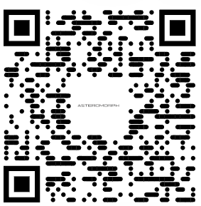

# 🚪 Deviceless Doorbell
## A doorbell for the broke and the bold – just scan the QR, we’re living in 2025.
> A device-free, QR-based smart doorbell — just scan and notify!



## 📌 Overview

**Deviceless Doorbell** is a minimalist, hardware-free smart doorbell system.  
All it takes is a printed QR code on your front door. Visitors scan it, and you'll instantly receive a notification on your phone.

No buttons. No wiring. Just the cloud.

## ✨ Features

- 📱 Instant alerts via Matrix / Telegram when QR is scanned
- 🌐 Hosted via [Vercel](https://vercel.com)
- ⚡ Simple FastAPI backend with webhook trigger
- 🧩 Integrates with custom Matrix bot (`doorbell_bot`)
- 🔒 No login, no user data, privacy-first

## 🛠️ How It Works

1. Visitor scans a QR code (located at your door).
2. The QR points to a URL like `https://your-vercel-app.vercel.app/notify`
3. This triggers a FastAPI server.
4. The server sends an encrypted message to your Element room (Matrix) or a Telegram bot.
5. You get notified: “🚪 Someone is at the door!”

## 🖼️ QR Code

The QR code is located at:
/doorbell/assets/img1.png


> You can print this QR and stick it on your door or nameplate!

## 🚀 Deployment

This project is deployed on [Vercel](https://vercel.com), but you can also self-host it.

### Requirements

- Python 3.9+
- `matrix-nio`, `fastapi`, `uvicorn`
- Optional: Telegram Bot API token

### Local Run

```bash
git clone https://github.com/zzuno/Deviceless-Doorbell.git
cd Deviceless-Doorbell

# Setup virtualenv
python -m venv venv
source venv/bin/activate

# Install deps
pip install -r requirements.txt

# Run server
uvicorn main:app --reload
```

## 📫 Notifications
Choose one or both:

Matrix: Send to your personal Element chatroom using doorbell_bot

Telegram: Alert via a Telegram bot using Bot API

Configure credentials using environment variables:

```bash
MATRIX_TOKEN=your_matrix_access_token
MATRIX_ROOM_ID=!abc123:matrix.org

BOT_TOKEN=your_telegram_bot_token
CHAT_ID=your_telegram_chat_id
```

## 🧠 Idea
“Why install a doorbell when everyone already has a smartphone?”

This project rethinks the doorbell with software and QR tech. Perfect for offices, shared housing, or minimalists who love frictionless design.

## 🤝 Contributing
Contributions, feature ideas, and feedback are welcome!
